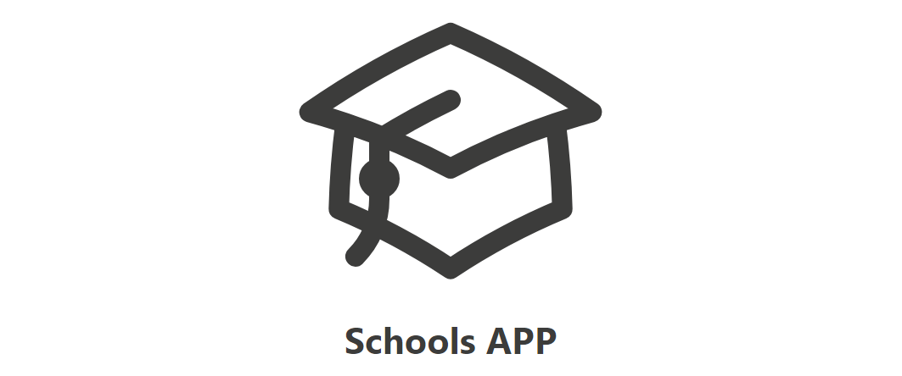
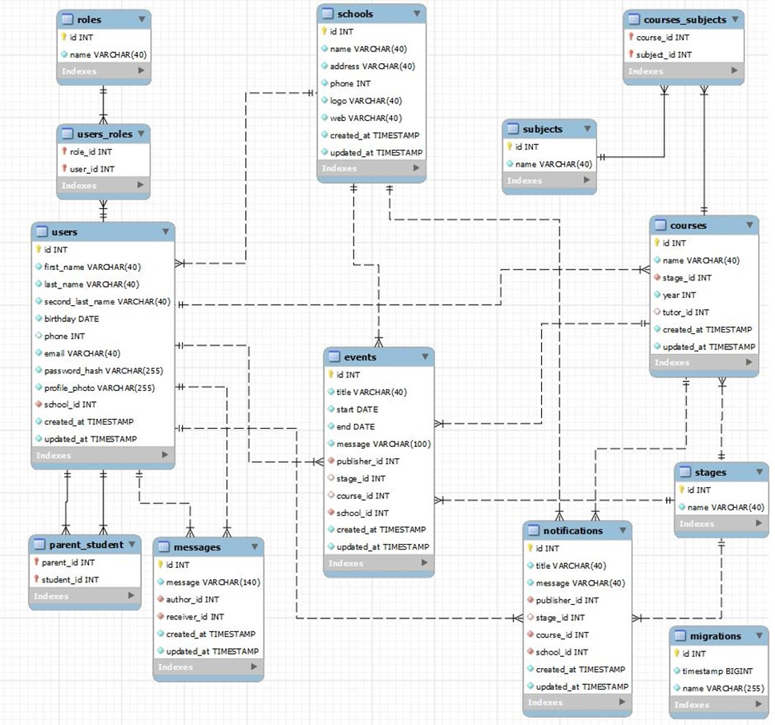

# Welcome to School APP

<center></center>

This is the last project in the FSD Bootcamp. This repository is the backend part of the School APP


  ## Content 📝
  <ol>
    <li><a href="#about-the-project">About the project</a></li>
    <li><a href="#stack">Stack</a></li>
    <li><a href="#deploy-🚀">Deploy</a></li>
    <li><a href="#local-installation">Installation</a></li>
    <li><a href="#api-information">API information</a></li>
    <li><a href="#db-diagram">DB diagram</a></li>
    <li><a href="#endpoints">Endpoints</a></li>
    <li><a href="#future-features">Future features</a></li>
    <li><a href="#development">Development</a></li>
    <li><a href="#contact">Contact</a></li>
  </ol>


## About the project

This platform is oriented to host different schools. Each school will have his own admin and that admin will create the "tree" of that school.

To create that "tree" the admin can create stages and add courses to these stages. Subjects can also be created and added to each course.

One of the key of the app is that users must be registered by the admin. Familys must give the data needed and the administrator will register each user. Immediately after the user is registered an email will be automatically sent by the app with the credentials. Users can be either teachers, parents, students or personal of the school.

Depending on the role of the user you can access different content.

Parents and Students can access:
- Calendar: with events as examns, works, vacations, etc. As admin or teacher you can use filters, if you are a parent or student you only can see your own events.
- Messages: a chat in which you can send and recieve messages to teachers and personal of the center.
- Nofitications: an official channel of communication of the school with students and parents.

Teachers will also have access to:
- Events: to create the events that will appear on the calendar. Fix dates to next examen or a work that has to be made.

Admin will have full access to last content and:
- Subjects: to create new subjects for the school.
- Stages: add stages that are imparted on the school (like: infantil, primaria, ESO, etc.)
- Courses: to add courses to the mentioned stages.
- Register: to create new users of the APP for the respective school.
- Users: to search for users and see their information.

***Here a sample of the frontend.

<div style="display: flex; justify-content: space-around;">
<center></center>
<center></center>
</div>


## Stack

<div align="center">
<a href="https://www.expressjs.com/">
    
</a>
<a href="https://nodejs.org/es/">
    
</a>
<a href="">
    
</a>
<a href="">
<a href="">
    
</a>

</a>
<a href="">
    
</a>
<a href="">
    
</a>
<a href="">
    
</a>
 </div>

## Deploy 🚀
<div align="center">
    <a href="https://schoolsapp-production.up.railway.app"><strong>schoolsapp-production.up.railway.app</strong></a>🚀🚀🚀
</div>


## Local installation

1. If you don't have MySQL installed on you computer, you can install Docker and execute the above command on your Powershell to create a MongoDB container
` $ docker run --name container-name -p 3310:3306 -e MYSQL_ROOT_PASSWORD=1234 -d mysql `
2. Clone the repository
` $ git clone https://github.com/Javi-Gallego/SchoolsAPP.git `
3. Install dependencies
` $ npm install `
4. Run server
` $ npm run dev `
5. Run migrations on DB
` $ npm run run-migrations `
6. Mock DB with seeders
` $ npm run seeds `

## API information
<details>
<summary>Work in local</summary>
The repository has a .env_local_sample. You have to change its name to .env to work properly

In the HTTP directory there is a file named schoolapp_local.json, you can open it with 'Thunder Client' to have all the endpoints of the API. For the endpoints examples below I will use the deployed url. In the social_network_local.json you have the url with your localhost.

If you will use the API in local, you need a connection to a DB and put the credentials in the .env as needed. These credentials will be in the .env_local_sample and will work with the docker container exposed in point 1 of the local installation.
</details>

<details>
<summary>Work with deployed server</summary>
In the HTTP directory theres a file named schoolapp_deployed.json, you can open it with 'Thunder Client' to have all the endpoints of the API.
</details>

<details>
<summary>Authentication</summary>

Only registered users can access the application and only an admin can register users. Once registerd, the app will automatically send an email with the credentials to enter. So the login page is the only one you can access without credentials.
When an endpoint needs authentication you must put the token given to you when you login in the Bearer Token field in "Auth". In the login endpoint I will put the admin email and password.

<center></center>

 For a fast comprehension we will use icons to show what is needed to see the endpoints:
 :angel: You must be logged as admin
 :man: You must be logged as a teacher or personal
 :earth_africa: This endpoint is global and can be viewed by every user registered 


</details>

## DB diagram
<center></center>

## Endpoints

<details>
<summary>Endpoints</summary>

- LOGIN

        POST https://schoolsapp-production.up.railway.app/api/auth/login 
    body:
    ``` js
        {
            "email": "admin@gmail.com",
            "password": "Aa123456"
        }
    ```
    This will be needed to obtain a token with admin credentials
    body:
    ``` js
        {
            "email": "yola@gmail.com",
            "password": "Aa123456"
        }
    ```
    This will be needed to obtain a token with teacher credentials
    body:
    ``` js
        {
            "email": "vicente@gmail.com",
            "password": "Aa123456"
        }
    ```
    This will be needed to obtain a token with parent credentials


- REGISTER :angel:

        POST https://schoolsapp-production.up.railway.app/api/auth/register
    body:
    ``` js
        {
            {
                "firstName": "Javier",
                "lastName": "Gallego",
                "secondLastName": "Garrido",
                "birthdate": "1984-29-01",
                "email": "galgar@gmail.com",
                "password": "Aa123456",
                "address": "Calle Rio Jarama n34",
                "schoolId": 1,
                "roleId": 3
            }
        }
    ```


- USERS

    - GET USERS :angel:

            GET https://schoolsapp-production.up.railway.app/api/users/?schoolId=1&roleName=4&firstName=Ja
 

        You can put some query params that will work as filters, they are optional to put and the value does not need to be exactly the same as in the database ie: if you search "Ja" as name it will retrieve every user thas has the string "Ja" in its user name. You can put as much filters as you want except for the roleName(it accepts an array of roles separated by a "," but it should be the roleName written exactly as in the DB)


- SUBJECTS

    - GET SUBJECTS :angel:

            GET https://schoolsapp-production.up.railway.app/api/subjects/1
  

        You need to put the SchoolId as param and it will retrieve all subjects of that school.

    - CREATE SUBJECT :angel:

            POST https://schoolsapp-production.up.railway.app/api/subjects
            body:
        ``` js
            {
                "name": "Química",
                "schoolId": 1
            
            }
        ```

    - DELETE SUBJECT :angel: 

            DELETE  https://schoolsapp-production.up.railway.app/api/subjects/7

        You need to pass the subjectId as param.


- STAGES

    - GET STAGES :angel:

            GET https://schoolsapp-production.up.railway.app/api/stages/1
  

        You need to put the SchoolId as param and it will retrieve all stages of that school.

    - CREATE STAGE :angel:

            POST https://schoolsapp-production.up.railway.app/api/stages
            body:
        ``` js
            {
                "name": "Química",
                "schoolId": 1       
            }
        ```

    - UPDATE STAGE :angel:

            PUT https://schoolsapp-production.up.railway.app/api/stages/8
            body:
        ``` js
            {
                "name": "Bioquímica",
            }
        ```

    You need to pass the new name of the stage in the body, and the stageId as a parameter in the url.


    - DELETE STAGE :angel: 

            DELETE  https://schoolsapp-production.up.railway.app/api/stages/7

        You need to pass the stageId as param. 
        **Only stages without a course assigned can be deleted.

- COURSES

    - GET COURSES :angel:

            GET https://schoolsapp-production.up.railway.app/api/courses
  

        This will automatically retrieve all the courses of the school.

    - CREATE COURSE :angel:

            POST https://schoolsapp-production.up.railway.app/api/courses
            body:
        ``` js
            {
                "name": "3º ESO",
                "stageId": 3,
                "year": 3,
                "tutorId": 13       
            }
        ```

    - UPDATE COURSE :angel:

            PUT https://schoolsapp-production.up.railway.app/api/courses/8
            body:
        ``` js
            {
                "tutorId": 11,
            }
        ```

    Only the tutor can be changed once the course is created. Course id is required as param.


    - DELETE COURSE :angel: 

            DELETE  https://schoolsapp-production.up.railway.app/api/courses/9

        You need to pass the courseId as param. 

- EVENTS

    - GET EVENTS :man:

            GET https://schoolsapp-production.up.railway.app/api/events?schoolId=1&stageId=3&courseId=2
  

        You need to put the SchoolId as param and it will retrieve all subjects of that school. You can also filter if you want to retrieve only events related to a stage or a course putting the id as a parameter.

        It will retrieve automatically all the events of the present year since January 1th

    - CREATE EVENT :man:

            POST https://schoolsapp-production.up.railway.app/api/events
            body:
        ``` js
            {
                "title": "Examen", 
                "start": "2024-05-21", 
                "end": "2024-05-21", 
                "description": "Examen de Física tema 11", 
                "schoolId": 1, 
                "stageId": 3, 
                "courseId": 2, 
                "publisherId": 11, 
                "backgroundColor": "red" 
            }
        ```

- MESSAGES

    - GET MESSAGES :earth_africa:

            GET https://schoolsapp-production.up.railway.app/api/messages
  

        It will automatically retrieve all messages that the userId of the token has.

    - CREATE MESSAGE :earth_africa:

            POST https://schoolsapp-production.up.railway.app/api/messages
            body:
        ``` js
            {
                "newMessage": "Esto es una prueba que no va a funcionar",
                "authorId": 2,
                "receiverId": 4
            }
        ```

        IF authorId doesnt match userId of the token, the message will not be created.

        
    - UPDATE MESSAGE :earth_africa:

            POST https://schoolsapp-production.up.railway.app/api/messages
            body:
        ``` js
            {
                "userId1": 2,
                "userId2": 4
            }
        ```
    This will automatically update the messages and put them as already seen. userId1 es the one who updates messages in which userId2 is the author and userId1 the receiver.
 
</details>

## Future features

[ ] Edit profile so each user can update their data (except email).

[ ] Possibility to erase relations (parent-student), (student-course)

## Development:

``` js
 const developer = "Javier Gallego";

 console.log("Desarrollado por: " + developer);
```  

## Contact
<div align="center">
<a href = "mailto:galgar@gmail.com"></a>
<a href="https://www.linkedin.com/in/javier-gallego-dev"></a>
<a href="https://github.com/Javi-Gallego"></a>
</div>